# GWU_Responsible_Machine_Learning
Group 3, the authors of this repository, spent seven weeks developing interpretable machine learning models during Summer 2022 in Professor Patrick Hall's Responsible Machine Learning course. The objective of our project is to predict the probability of applicants being charged a higher rate than others for mortgages using the Home Mortgage Disclosure Act's historic mortgage reporting data. To avoid the impetuous of deploying black-box machine learning models into social populaces that can be adversely affected by bias, our group strived to develop explainable and interpretable predictive models that improve trust and encourage ethical decisions. 
  
## Model Details

### Authors
   * Kyle Lyon, `kylelyon@gwu.edu`
   * Charles Bloomer, `insert email`
   * Zeeshan Raza, `zraza10@gwu.edu`
   * Ziyad Maknojia, `zam@gwu.edu`

### Basic Information
* **Model date**: May, 2022
* **Model version**: 1.0
* **License**: Apache
* **Model implementation code**: TBD

### Intended Use
* **Primary intended uses**: This research team aims to reduce discrimination and bias in the issuance of mortgage rates to applicants by providing transparency with explainable machine learning models.
* **Primary intended users**: Students, professors, and members of the George Washington University may use this repository.
* **Out-of-scope use cases**: Models that appear in this repository are for educational-purposes and should not be used to determine real-world credit worthiness.

## Training Data

* **Data dictionary**:

| Name | Modeling Role | Measurement Level| Description|
| :----: | :-------------: | :----------------: | :----------: |
| black | input | binary | whether the borrower is Black (1) or not (0)|
| asian | input | binary | whether the borrower is Asian (1) or not (0)|
| white | input | binary | whether the borrower is White (1) or not (0)|
| male | input | binary | whether the borrower is male (1) or not (0) |
| female | input | binary | whether the borrower is female (1) or not (0)|
| term 360 | input | binary | whether the mortgage is a standard 360 month mortgage (1) or a different type of mortgage (0)|
| conforming | input | binary | whether the mortgage conforms to normal standards (1), or whether the loan is different (0), e.g., jumbo, HELOC, reverse mortgage, etc.|
| debt to income ratio missing | input | binary | missing marker (1) for debt to income ratio std|
| loan amount std | input | int | standardized amount of the mortgage for applicants|
| loan to value ratio std | input | float | ratio of the mortgage size to the value of the property for mortgage applicants|
| no intro rate period std | input | binary | whether or not a mortgage does not include an introductory rate period |
| intro rate period std | input | float | standardized introductory rate period for mortgage applicants |
| property value std | input | int | value of the mortgaged property |
| income std | input | int | standardized income for mortgage applicants |
| debt to income ratio std | input | float | standardized debt-to-income ratio for mortgage applicants |
| phat | input | float | prediction probabilities of high-priced mortgage for mortgage applicants |
| r | input | int | log loss residuals for the predicted probabilities |
| high priced | input | binary| whether (1) or not (0) the annual percentage rate (APR) charged for a mortgage is 150 basis points (1.5%) or more above a survey-based estimate of similar mortgages |

* **Source of training data**: Home Mortgage Disclosure Act (HMDA) Aggregate Lending Data [[Source]](https://github.com/jphall663/GWU_rml/tree/master/assignments/data) [[Website]](https://www.ffiec.gov/hmda/history2.htm)
* **How training data was divided into training and validation data**: 70% Training, 30% Validation 
* **Number of rows in training and validation data**:
  * Training rows: 112,237, columns=23
  * Validation rows: 48,101, columns=23

## Test Data
* **Source of test data**:  Home Mortgage Disclosure Act (HMDA) aggregate lending data [[Source]](https://github.com/jphall663/GWU_rml/tree/master/assignments/data)
* **Number of rows in test data**: 19830
* **State any differences in columns between training and test data**: All the columns are as the same as the training & validation data, except for that the target variable **high priced** column does not exist in this test data.

## Model Details
* **Columns used as inputs in the final model**:
   * `property_value_std`, `no_intro_rate_period_std`, `loan_amount_std`, `income_std`, `conforming`, `intro_rate_period_std`, `debt_to_income_ratio_std`, `term_360`
* **Column(s) used as target(s) in the final model**: "high_priced"
* **Type of models**: 
  * Explainable Boosting Machine (EBM)
  * Decision Tree 
* **Software used to implement the model**: Python 3.6.9, [InterpretML](https://github.com/interpretml/interpret) v0.2.5.
* **Hyperparameters or other settings of your model**:
   * `'max_bins': 512`, `'max_interaction_bins': 16`, `'interactions': 10`, `'outer_bags': 4`, `'inner_bags': 0`, `'learning_rate': 0.001`, `'validation_size': 0.25`, `'min_samples_leaf': 5`, `'max_leaves': 5`, `'early_stopping_rounds': 100.0`, `'n_jobs': NTHREAD`, `'random_state': SEED`

## Quantitative Analysis
   * #### Local Feature Importance Across Models  
   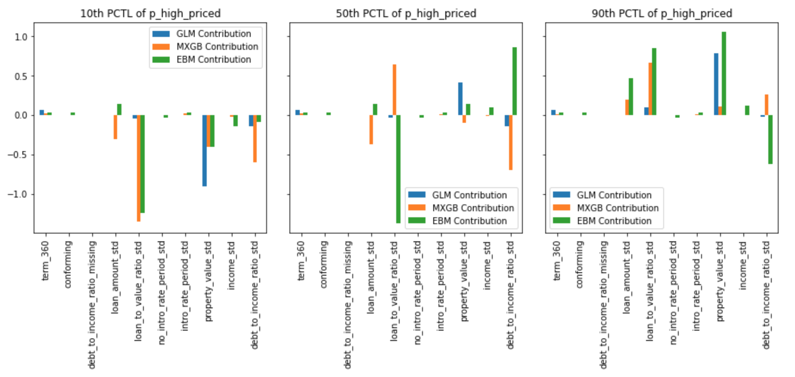
   * #### Global Feature Importance Across Models  
   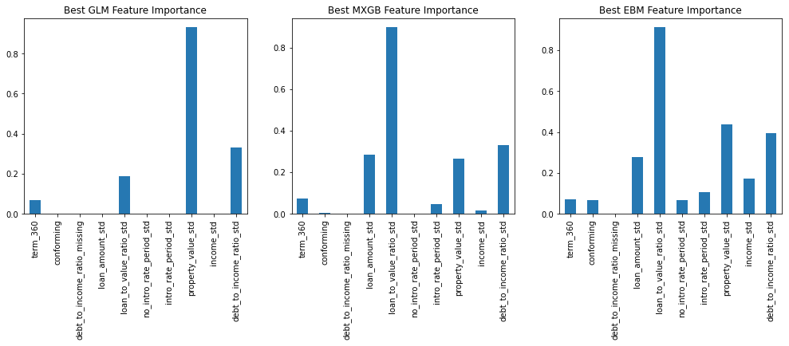
   * #### Partial Dependence Plots 
   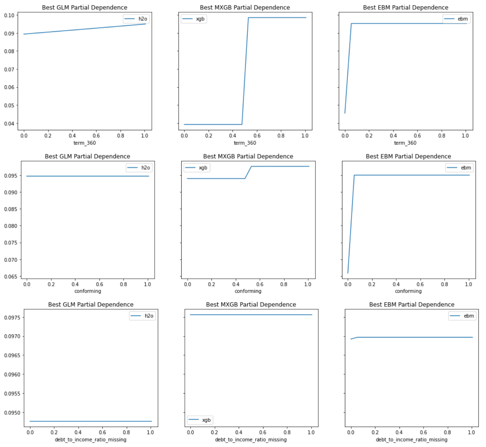  
   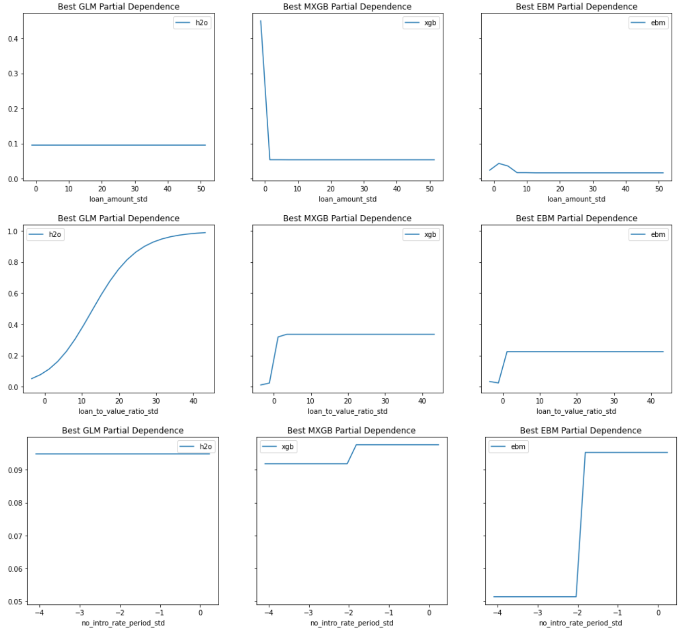  
   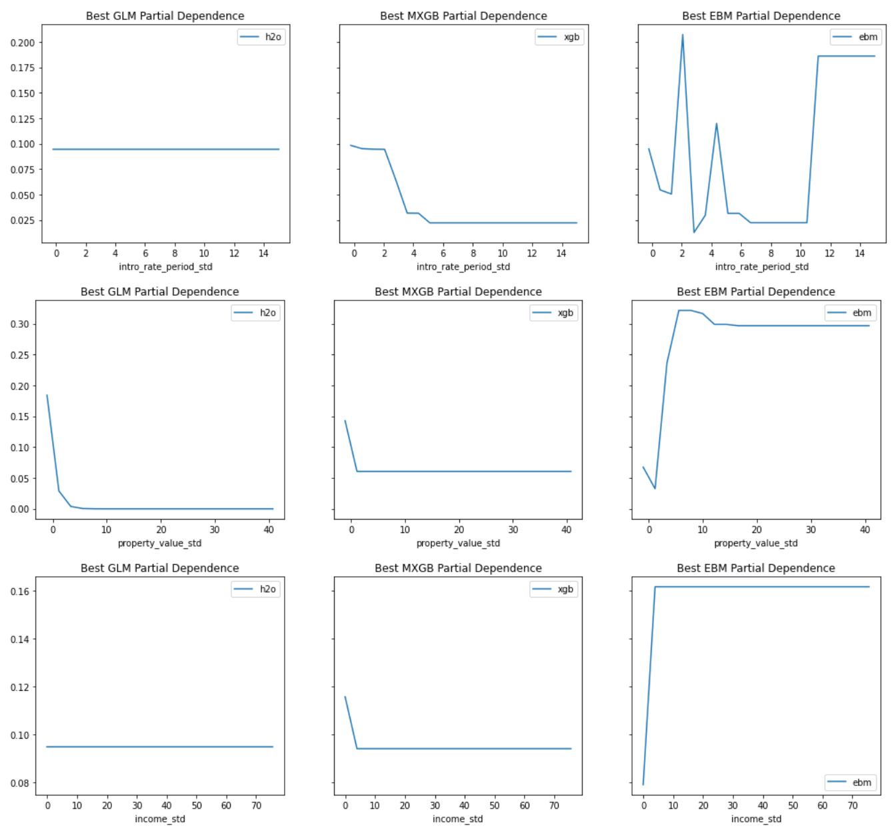  
   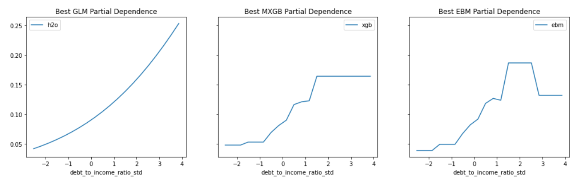  
   * #### Grid Search Results Plot  
   
   * #### Best AIR and AUC  
   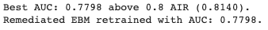
   * #### Best Model Hyperparameters  
   
   * #### Best Model Features  
   
   * #### Model Extraction Attack  
   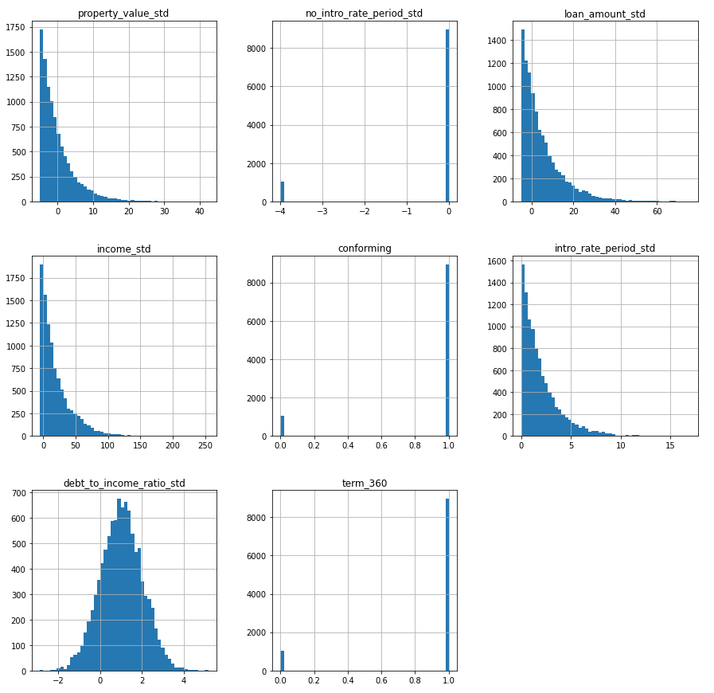
   * #### Stolen Decision Tree Model  
   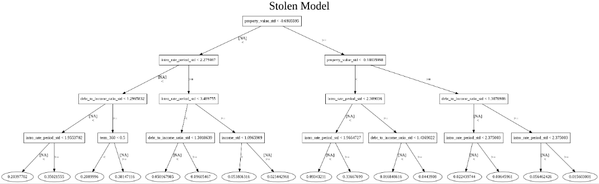
   * #### Variable Importance: H20 Distributed Randomo Forest  
   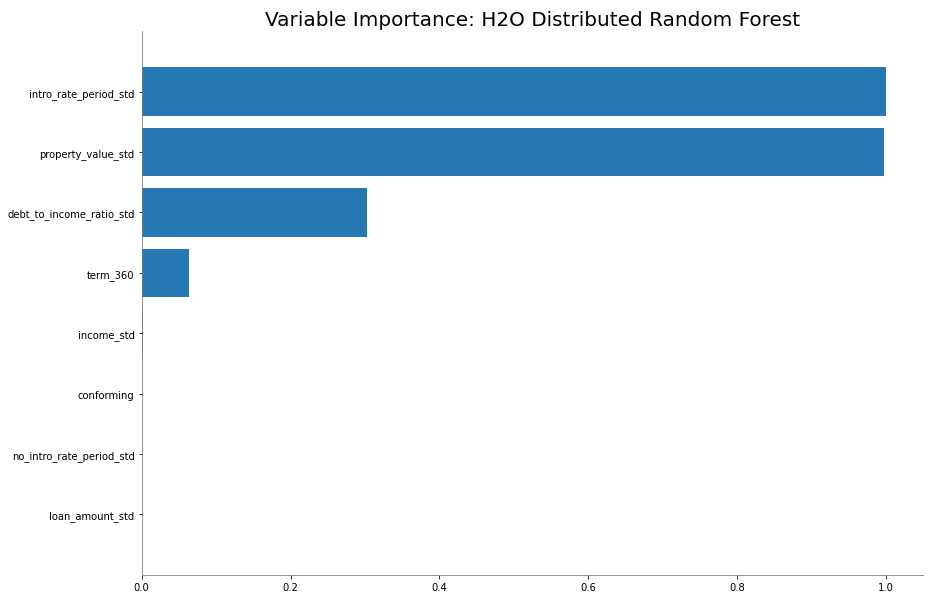
   * #### Sensitivity Analysis: Stress Testing  
   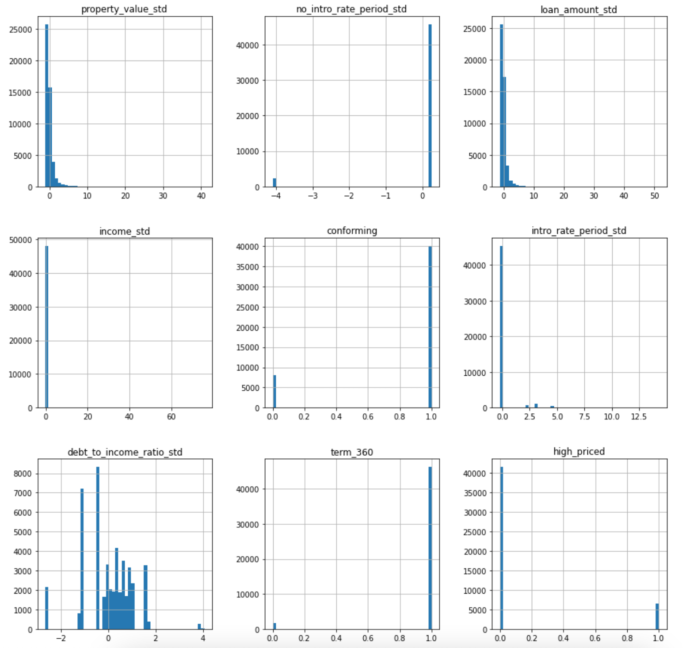
   * #### Residual Analysis
   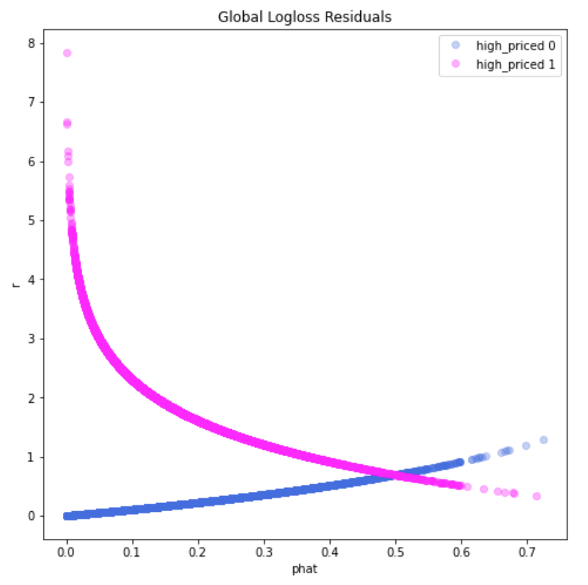

## Ethical Considerations
